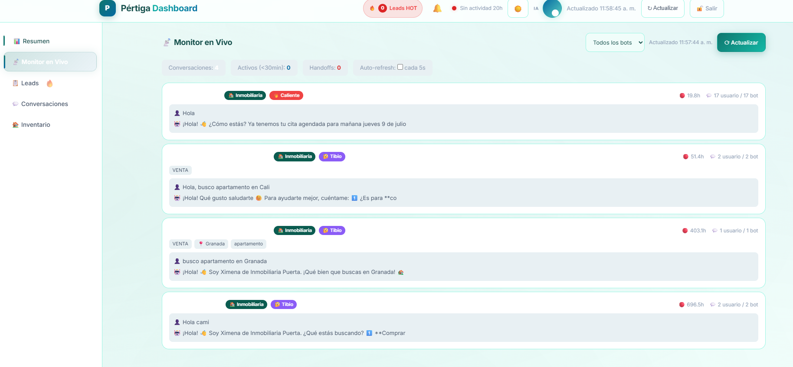
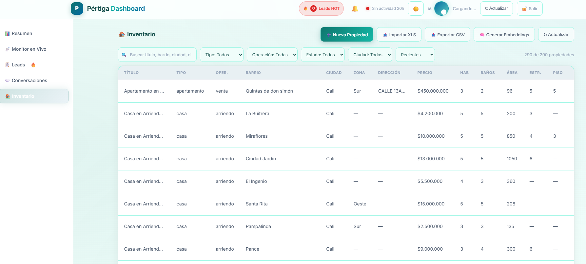
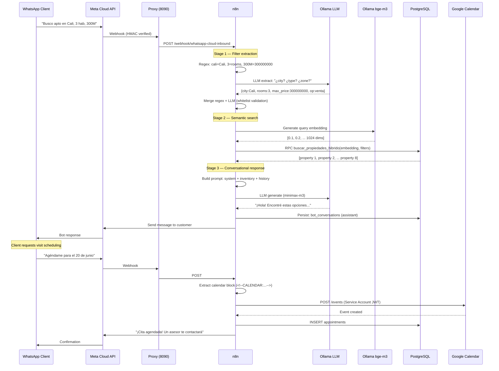

# 🏠 Inmobiliaria Puerta — WhatsApp Bot + Dashboard

**Comprehensive AI-powered WhatsApp real estate system**

A WhatsApp bot powered by LLM that serves clients automatically: searches properties using semantic embeddings, schedules visits via Google Calendar, qualifies leads with automatic scoring, and generates conversational reports. Includes an operational dashboard for real-time conversation monitoring, lead management, and property inventory control. In production since June 2026.


<!-- SCREENSHOTS -->


*Main dashboard: real-time KPIs (unique users, messages, leads, conversion), daily activity (7d/30d/90d), and conversion funnel.*



*Live monitor: 5s polling of active conversations, lead score filter, Meta webhook status.*



*Inventory: properties with filters by city/zone/type/status, bge-m3 embedding generation (individual + batch).*

---

## 🎯 Context

**Pértiga Soluciones SAS** developed **Inmobiliaria Puerta**, a comprehensive WhatsApp-based real estate service system. The bot ("Ximena") converses naturally with clients, understands their preferences, searches properties from inventory using hybrid semantic search, schedules visits via Google Calendar, and automatically qualifies leads. The dashboard lets the team monitor all this in real time.

## ✅ What the System Does

### 🤖 WhatsApp Bot (Inmobiliaria Puerta)

- **Natural Colombian Spanish conversation** with "Ximena" personality
- **Semantic property search**: combines vector embeddings (bge-m3, 1024-dim) with hard SQL filters
- **LLM filter extraction**: understands "busco apartamento en Cali zona norte, 3 hab, presupuesto 300 millones" without commands
- **Two-stage search**:
  1. **Stage 1**: LLM extracts structured parameters (city, zone, type, budget, rooms, neighborhood)
  2. **Stage 2**: generates vector embedding + hybrid search in PostgreSQL (pgvector)
- **Visit scheduling** via Google Calendar API (create, edit, cancel)
- **Automatic lead scoring**: new → cold → warm → hot based on interaction
- **Conversation persistence** in PostgreSQL for historical context
- **5-phase sales flow**: GREETING → QUALIFICATION → BUDGET → CTA → CLOSE
- **Anti-hallucination validation**: bot only recommends properties from real inventory, with exact prices

### 📊 Operational Dashboard

- **📊 Real-time KPIs**: unique users, messages, leads, conversion rate, response time
- **📡 Live monitor**: active conversation streaming with auto-refresh
- **📋 Leads**: automatic scoring, filters, CSV export, per-lead history
- **💬 Conversations**: full message history, phone-based search
- **🏠 Inventory**: property CRUD, embedding generation, bulk import, CSV export

---

## 🏗️ Architecture

```
                    WhatsApp Client
                         │
                         ▼
              Meta Cloud API (WhatsApp Business)
                         │
                         ▼ webhook
              Cloudflare Tunnel (webhook.pertigasoluciones.com)
                         │
                         ▼
              Node.js Proxy (port 8090)
              ┌────────────────────────────────┐
              │ • HMAC-SHA256 signature verify  │
              │ • Rate limiting (60 req/min/IP) │
              │ • Bot blocklist                  │
              │ • Routing by phone_number_id     │
              └───────────┬────────────────────┘
                          │
                          ▼
              n8n Workflow (Real Estate Bot)
              ┌─────────────────────────────────────────────┐
              │ Stage 1: Filter extraction                    │
              │   ├── Regex extraction (operation, city,     │
              │   │   zone, type, price, rooms)              │
              │   ├── LLM extraction (nemotron-3-super)      │
              │   └── Merge: regex + LLM with whitelist       │
              │                                               │
              │ Stage 2: Hybrid semantic search                │
              │   ├── Generate embedding (bge-m3, 1024-dim)   │
              │   ├── PostgREST RPC: buscar_propiedades_hibrido
              │   ├── Hard SQL filters (type, zone, city)    │
              │   └── Order by cosine similarity              │
              │                                               │
              │ Stage 3: Conversational response              │
              │   ├── LLM (minimax-m3) with system prompt     │
              │   ├── Inventory injected into prompt          │
              │   └── Hidden blocks for Google Calendar       │
              │                                               │
              │ Persistence:                                  │
              │   ├── bot_conversations (PostgreSQL)          │
              │   ├── leads (scoring, preferences)            │
              │   └── appointments (scheduled visits)         │
              └───────────┬──────────────────────────────────┘
                          │
                          ▼
              PostgreSQL (Supabase) + pgvector
              ┌────────────────────────────────┐
              │ • properties (289, embedding)   │
              │ • leads (scoring, preferences)  │
              │ • bot_conversations             │
              │ • appointments                  │
              │ • buscar_propiedades_hibrido()  │
              └───────────┬────────────────────┘
                          │
                          ▼
              Dashboard (port 3002)
              ┌────────────────────────────────┐
              │ Vanilla JS SPA (2800+ lines)    │
              │ • KPIs, charts, funnel          │
              │ • Live monitor (5s polling)      │
              │ • Property CRUD + embeddings    │
              │ • Lead management                │
              │                                 │
              │ Node.js backend (530 lines)     │
              │ • SHA-256 auth + 24h cookie     │
              │ • Rate limiting (5/15min)        │
              │ • PostgREST proxy + API key     │
              │ • Embedding gen via Ollama      │
              └────────────────────────────────┘
```

## 🔧 Tech Stack

| Component | Technology | Purpose |
|-----------|------------|---------|
| **WhatsApp** | Meta Cloud API + Cloudflare Tunnel | Incoming message webhook |
| **Proxy** | Node.js (native http, 323 lines) | HMAC verify, rate limiting, bot routing |
| **Orchestration** | n8n (visual workflow) | Bot processing pipeline |
| **LLM (extraction)** | nemotron-3-super:cloud (Ollama API) | Extract filters from natural language |
| **LLM (response)** | minimax-m3:cloud (Ollama API) | Generate conversational response |
| **Embeddings** | bge-m3 (Ollama, 1024-dim) | Property and query vectorization |
| **Database** | PostgreSQL (Supabase) + pgvector | properties, leads, conversations, appointments |
| **REST API** | PostgREST | CRUD over PostgreSQL |
| **Frontend** | Vanilla HTML/CSS/JavaScript | SPA with tabs, charts, tables, modals |
| **Dashboard Backend** | Node.js (native http, 530 lines) | Auth, API proxy, embedding management |
| **Scheduling** | Google Calendar API (Service Account JWT) | Create/edit/cancel visits |

## 🛠️ Tech Stack & Patterns

### WhatsApp Bot — Processing Pipeline
- **Webhook verification** HMAC-SHA256 with Meta App Secret
- **Rate limiting** in-memory (60 req/min per IP)
- **Bot blocklist** to filter known spam numbers
- **Routing by phone_number_id**: supports multiple bots on the same proxy
- **Hybrid filter extraction**: regex (fast) + LLM (natural language understanding), with whitelist validation
- **Negation detection**: "no quiero apartamento, busco casa" → adjusts filters correctly
- **Historical context**: uses last 20 messages to maintain context in long conversations
- **Retry with exponential backoff** on LLM calls (429 rate limits)
- **SQL fallback**: if semantic search returns few results, merges with pure SQL
- **Amenity boost**: amenities (pool, gym) reorder results, don't filter

### Hybrid Semantic Search (PostgreSQL + pgvector)
- **289 properties** vectorized with bge-m3 (1024 dimensions)
- **RPC function** `buscar_propiedades_hibrido` in PL/pgSQL
- **Dynamic threshold**: 0.01 with barrio filter, 0.05 with other hard filters, 0.15 without filters
- **ILIKE fuzzy match** for neighborhoods (case-insensitive, partial match)
- **Zone as boost** (not hard filter): +0.15 if match, -0.03 if not
- **Flexible price**: filters up to 130% of max budget
- **COALESCE** for properties without embedding (appear if they match SQL)

### Frontend (Vanilla JS, no framework)
- **SPA architecture** with dynamic tab/section system
- **Custom charts** (bars, funnel) built from scratch with CSS/flexbox
- **Polling system** with configurable auto-refresh
- **Advanced filters**: date range (7d/30d/90d/custom), search, sort
- **Table pagination** implemented manually
- **CSV export** of inventory
- **Light/Dark theme** with localStorage persistence
- **Responsive design** (sidebar + bottom-nav on mobile)

### Dashboard Backend
- **Custom HTTP server** (Node `http` module, no Express)
- **Authentication system** with SHA-256, cookie sessions, 24h expiry
- **Rate limiting**: 5 attempts → 15 min lockout (in-memory map)
- **Reverse proxy**: injects API key server-side (never exposed to client)
- **Ollama integration** for embedding generation (batch + individual)
- **PostgREST proxy** with retries and timeout handling
- **Batch processing** of embeddings (50 properties concurrent)

### DevOps & Infrastructure
- **Nginx reverse proxy** with SSL/TLS (Let's Encrypt)
- **Cloudflare Tunnel** (named tunnel) for Meta webhook — fixed URL without exposing IP
- **Docker Compose** for the stack (Supabase, n8n)
- **Systemd services** for persistent processes
- **Ollama** running locally with cloud models (minimax-m3, nemotron-3-super, bge-m3)

## 🗂️ Bot Flow — Mermaid Diagram



## 📁 Repository Structure

```
pertiga-dashboard/
├── README.md
├── README.en.md
├── LICENSE
├── src/
│   ├── server.js              # Dashboard backend (real code excerpt)
│   ├── index.html             # Frontend SPA (real code excerpt)
│   ├── proxy.js               # Meta webhook proxy (real code excerpt)
│   └── system-prompt.md       # Bot system prompt (excerpt)
└── docs/
    ├── arquitectura.md        # Technical details with Mermaid diagrams
    ├── schema.sql             # Simplified DB schema
    ├── screenshot-dashboard-resumen.png
    ├── screenshot-dashboard-monitor.png
    └── screenshot-dashboard-inventario.png
```

> ⚠️ **Note on source code**: As this is an active commercial product, the full source code is not published. Files in `src/` are real production code excerpts (sanitized) showing the architecture and patterns used.

## ⚠️ Notes

- System in **active production** for Inmobiliaria Puerta (Pértiga Soluciones SAS client)
- Bot uses Meta Cloud API with WhatsApp Business account
- **289 properties** in inventory with vector embeddings
- Webhook domain: `webhook.pertigasoluciones.com` (Cloudflare Tunnel)
- Dashboard accessible at `pertigasoluciones.com/dashboard/`

## 🔗 Related Links

- **Public site**: https://pertigasoluciones.com
- **Other public project**: [Manualito en Daruma](https://github.com/pertiga-gio/manualito-en-daruma) — job functions manual search

## 👤 Author

Developed by **Giovanni Sánchez Soto** — June-July 2026

Pértiga Soluciones SAS — AI Automation.
