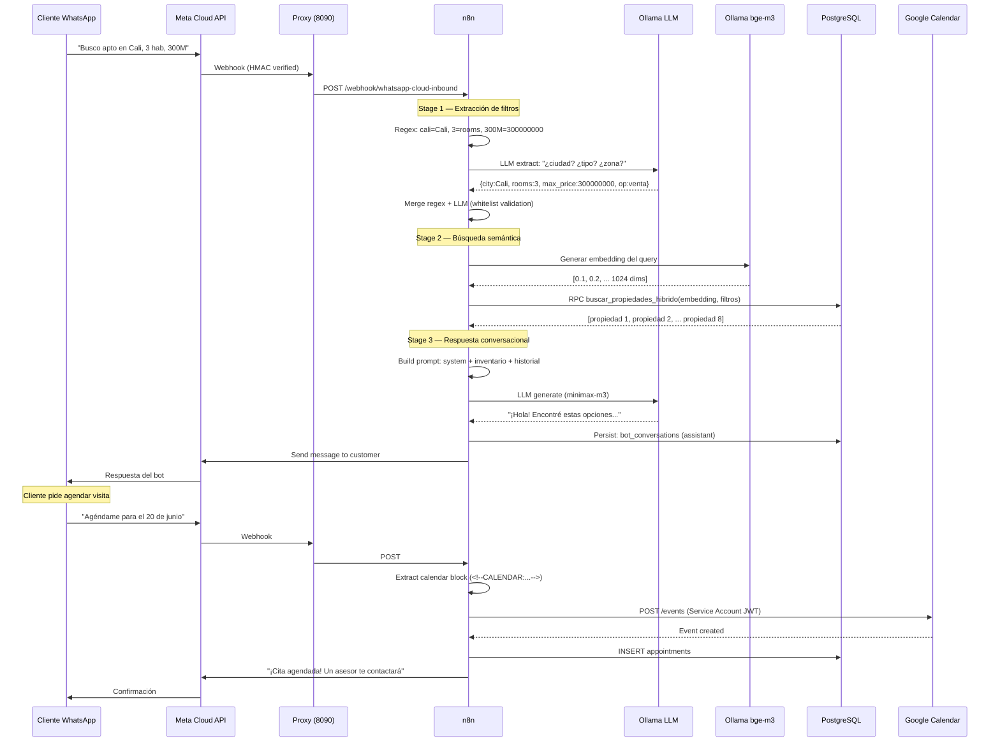

# 🏠 Inmobiliaria Puerta — Bot de WhatsApp + Dashboard

**Sistema integral de atención inmobiliaria por WhatsApp con IA**

Bot de WhatsApp potenciado por LLM que atiene clientes automáticamente: busca propiedades con embeddings semánticos, agenda visitas en Google Calendar, qualifica leads con scoring automático, y genera reportes conversacionales. Incluye un dashboard operacional para monitorear conversaciones en tiempo real, gestionar leads y administrar el inventario de propiedades. Desplegado en producción desde junio de 2026.


<!-- SCREENSHOTS -->


*Dashboard principal: KPIs en tiempo real (usuarios únicos, mensajes, leads, conversión), actividad por día (7d/30d/90d) y funnel de conversión.*


*Monitor en vivo: polling cada 5s de conversaciones activas, filtro por score de lead, estado del webhook Meta.*


*Inventario: propiedades con filtros por ciudad/zona/tipo/estado, generación de embeddings bge-m3 individual y batch.*

---

## 🎯 Contexto

**Pértiga Soluciones SAS** desarrolló **Inmobiliaria Puerta**, un sistema integral de atención inmobiliaria por WhatsApp. El bot ("Ximena") converse de forma natural con clientes, entiende sus preferencias, busca propiedades del inventario usando búsqueda semántica híbrida, agenda visitas en Google Calendar, y qualifica leads automáticamente. El dashboard permite al equipo monitorear todo esto en tiempo real.

## ✅ Qué hace el sistema

### 🤖 Bot de WhatsApp (Inmobiliaria Puerta)

- **Conversación natural en español colombiano** con personalidad "Ximena"
- **Búsqueda semántica de propiedades**: combina embeddings vectoriales (bge-m3, 1024-dim) con filtros SQL duros
- **Extracción de filtros con LLM**: entiende "busco apartamento en Cali zona norte, 3 hab, presupuesto 300 millones" sin comandos
- **Búsqueda en dos stages**:
  1. **Stage 1**: LLM extrae parámetros estructurados (ciudad, zona, tipo, presupuesto, habitaciones, barrio)
  2. **Stage 2**: generan embedding vectorial + búsqueda híbrida en PostgreSQL (pgvector)
- **Agendamiento de visitas** vía Google Calendar API (crear, editar, cancelar)
- **Lead scoring automático**: nuevo → frío → tibio → caliente según interacción
- **Persistencia de conversaciones** en PostgreSQL para contexto histórico
- **Flujo de ventas de 5 fases**: SALUDO → CALIFICACIÓN → PRESUPUESTO → CTA → CIERRE
- **Validación anti-alucinación**: el bot solo recomienda propiedades del inventario real, con precios exactos

### 📊 Dashboard Operacional

- **📊 KPIs en tiempo real**: usuarios únicos, mensajes, leads, tasa de conversión, tiempo de respuesta
- **📡 Monitor en vivo**: streaming de conversaciones activas con auto-refresh
- **📋 Leads**: scoring automático, filtros, exportación CSV, historial por lead
- **💬 Conversaciones**: histórico completo de mensajes, búsqueda por teléfono
- **🏠 Inventario**: CRUD de propiedades, generación de embeddings, importación masiva, exportación CSV

---

## 🏗️ Arquitectura

```
                    Cliente WhatsApp
                         │
                         ▼
              Meta Cloud API (WhatsApp Business)
                         │
                         ▼ webhook
              Cloudflare Tunnel (webhook.pertigasoluciones.com)
                         │
                         ▼
              Proxy Node.js (puerto 8090)
              ┌────────────────────────────────┐
              │ • HMAC-SHA256 signature verify  │
              │ • Rate limiting (60 req/min/IP) │
              │ • Bot blocklist                  │
              │ • Routing por phone_number_id    │
              └───────────┬────────────────────┘
                          │
                          ▼
              n8n Workflow (Bot Inmobiliaria)
              ┌─────────────────────────────────────────────┐
              │ Stage 1: Extracción de filtros                │
              │   ├── Regex extraction (operación, ciudad,   │
              │   │   zona, tipo, precio, habitaciones)      │
              │   ├── LLM extraction (nemotron-3-super)      │
              │   └── Merge: regex + LLM con whitelist        │
              │                                               │
              │ Stage 2: Búsqueda semántica híbrida            │
              │   ├── Generar embedding (bge-m3, 1024-dim)   │
              │   ├── PostgREST RPC: buscar_propiedades_hibrido
              │   ├── Filtros SQL duros (tipo, zona, ciudad)  │
              │   └── Orden por cosine similarity             │
              │                                               │
              │ Stage 3: Respuesta conversacional              │
              │   ├── LLM (minimax-m3) con system prompt      │
              │   ├── Inventario inyectado en prompt          │
              │   └── Bloques ocultos para Google Calendar    │
              │                                               │
              │ Persistencia:                                  │
              │   ├── bot_conversations (PostgreSQL)          │
              │   ├── leads (scoring, preferencias)           │
              │   └── appointments (visitas agendadas)        │
              └───────────┬──────────────────────────────────┘
                          │
                          ▼
              PostgreSQL (Supabase) + pgvector
              ┌────────────────────────────────┐
              │ • properties (289, embedding)   │
              │ • leads (scoring, preferences)  │
              │ • bot_conversations             │
              │ • appointments                  │
              │ • buscar_propiedades_hibrido()  │
              └───────────┬────────────────────┘
                          │
                          ▼
              Dashboard (puerto 3002)
              ┌────────────────────────────────┐
              │ SPA Vanilla JS (2800+ líneas)   │
              │ • KPIs, charts, funnel          │
              │ • Monitor en vivo (polling 5s)  │
              │ • CRUD propiedades + embeddings │
              │ • Gestión de leads              │
              │                                 │
              │ Backend Node.js (530 líneas)    │
              │ • Auth SHA-256 + cookie 24h     │
              │ • Rate limiting (5/15min)        │
              │ • Proxy PostgREST + API key     │
              │ • Gen. embeddings via Ollama    │
              └────────────────────────────────┘
```

## 🔧 Stack Técnico

| Componente | Tecnología | Función |
|-----------|------------|---------|
| **WhatsApp** | Meta Cloud API + Cloudflare Tunnel | Webhook de mensajes entrantes |
| **Proxy** | Node.js (http nativo, 323 líneas) | HMAC verify, rate limiting, routing por bot |
| **Orquestación** | n8n (workflow visual) | Pipeline de procesamiento del bot |
| **LLM (extracción)** | nemotron-3-super:cloud (Ollama API) | Extrae filtros del lenguaje natural |
| **LLM (respuesta)** | minimax-m3:cloud (Ollama API) | Genera respuesta conversacional |
| **Embeddings** | bge-m3 (Ollama, 1024-dim) | Vectorización de propiedades y query |
| **Base de datos** | PostgreSQL (Supabase) + pgvector | properties, leads, conversations, appointments |
| **API REST** | PostgREST | CRUD sobre PostgreSQL |
| **Frontend** | Vanilla HTML/CSS/JavaScript | SPA con tabs, charts, tablas, modals |
| **Backend Dashboard** | Node.js (http nativo, 530 líneas) | Auth, API proxy, embedding management |
| **Agendamiento** | Google Calendar API (Service Account JWT) | Crear/editar/cancelar visitas |

## 🛠️ Stack y patrones técnicos

### Bot de WhatsApp — Pipeline de procesamiento
- **Webhook verification** HMAC-SHA256 con Meta App Secret
- **Rate limiting** en memoria (60 req/min por IP)
- **Bot blocklist** para filtrar números de spam conocidos
- **Routing por phone_number_id**: soporta múltiples bots en el mismo proxy
- **Extracción híbrida de filtros**: regex (rápido) + LLM (comprensión natural), con whitelist de valores válidos
- **Negación detection**: "no quiero apartamento, busco casa" → ajusta filtros correctamente
- **Contexto histórico**: usa últimos 20 mensajes para mantener contexto en conversaciones largas
- **Retry con exponential backoff** en llamadas a LLM (429 rate limits)
- **Fallback SQL**: si la búsqueda semántica devuelve pocos resultados, fusiona con SQL puro
- **Amenity boost**: las amenidades (piscina, gimnasio) reordenan resultados, no filtran

### Búsqueda Semántica Híbrida (PostgreSQL + pgvector)
- **289 propiedades** vectorizadas con bge-m3 (1024 dimensiones)
- **RPC function** `buscar_propiedades_hibrido` en PL/pgSQL
- **Threshold dinámico**: 0.01 con filtro de barrio, 0.05 con otros hard filters, 0.15 sin filtros
- **ILIKE fuzzy match** para barrios (case-insensitive, partial match)
- **Zona como boost** (no filtro duro): +0.15 si coincide, -0.03 si no
- **Precio flexible**: filtra hasta 130% del presupuesto máximo
- **COALESCE** para propiedades sin embedding (aparecen si matchean por SQL)

### Frontend (Vanilla JS, sin framework)
- **Arquitectura SPA** con sistema de tabs/secciones dinámicas
- **Gráficos custom** (barras, funnel) construidos a mano con CSS/flexbox
- **Sistema de polling** con auto-refresh configurable
- **Filtros avanzados**: rango de fechas (7d/30d/90d/custom), búsqueda, sort
- **Paginación** de tablas implementada manualmente
- **Exportación CSV** de inventario
- **Light/Dark theme** con persistencia en localStorage
- **Responsive design** (sidebar + bottom-nav en móvil)

### Backend Dashboard
- **Servidor HTTP custom** (módulo `http` de Node, sin Express)
- **Sistema de autenticación** con SHA-256, sesiones con cookie, expiración 24h
- **Rate limiting**: 5 intentos → bloqueo 15 min (map en memoria)
- **Proxy reverse**: inyecta API key del lado del servidor (nunca expone al cliente)
- **Integración con Ollama** para generación de embeddings (batch + individual)
- **PostgREST proxy** con reintentos y timeout handling
- **Batch processing** de embeddings (50 propiedades concurrente)

### DevOps e infraestructura
- **Nginx reverse proxy** con SSL/TLS (Let's Encrypt)
- **Cloudflare Tunnel** (named tunnel) para webhook de Meta — URL fija sin exponer IP
- **Docker Compose** para el stack (Supabase, n8n)
- **Systemd services** para procesos persistente
- **Ollama** corriendo local con modelos cloud (minimax-m3, nemotron-3-super, bge-m3)

## 📊 Esquema de base de datos (simplificado)

```sql
-- Propiedades con embeddings vectoriales para búsqueda semántica
properties (
  id UUID PRIMARY KEY,
  title TEXT, property_type TEXT, operation_type TEXT,
  neighborhood TEXT, city TEXT, price BIGINT,
  rooms INT, bathrooms INT, area_sqm INT,
  tiene_piscina BOOL, tiene_gimnasio BOOL, ...  -- 20+ amenidades
  embedding VECTOR(1024),  -- bge-m3
  zona TEXT, status TEXT DEFAULT 'disponible'
)

-- Leads con scoring automático
leads (
  id UUID PRIMARY KEY,
  phone_number TEXT UNIQUE,
  name TEXT, email TEXT,
  lead_score TEXT CHECK IN ('nuevo','frio','tibio','caliente'),
  budget_min BIGINT, budget_max BIGINT,
  preferred_neighborhood TEXT, preferred_property_type TEXT,
  preferred_operation TEXT CHECK IN ('venta','arriendo'),
  notes TEXT, last_contact_at TIMESTAMPTZ
)

-- Conversaciones del bot de WhatsApp
bot_conversations (
  id UUID PRIMARY KEY,
  phone TEXT, role TEXT CHECK IN ('user','assistant'),
  content TEXT, created_at TIMESTAMPTZ
)

-- Función RPC: búsqueda semántica híbrida
buscar_propiedades_hibrido(
  query_embedding VECTOR(1024),
  match_threshold FLOAT, match_count INT,
  filtro_zona TEXT, filtro_operacion TEXT,
  filtro_tipo TEXT, filtro_ciudad TEXT,
  precio_maximo BIGINT, filtro_rooms_min INT,
  filtro_barrio TEXT, ...  -- 12 filtros de amenidades
)

-- Visitas agendadas (por el bot de WhatsApp)
appointments (
  id UUID PRIMARY KEY,
  lead_id UUID REFERENCES leads(id),
  property_id UUID REFERENCES properties(id),
  scheduled_at TIMESTAMPTZ,
  status TEXT CHECK IN ('agendada','confirmada','cancelada','completada')
)
```

## 🗂️ Flujo del bot — Diagrama Mermaid



## 📁 Estructura del repositorio

```
pertiga-dashboard/
├── README.md
├── README.en.md
├── LICENSE
├── src/
│   ├── server.js              # Backend dashboard (extracto de código real)
│   ├── index.html             # Frontend SPA (extracto de código real)
│   ├── proxy.js               # Proxy webhooks Meta (extracto de código real)
│   └── system-prompt.md       # System prompt del bot (extracto)
└── docs/
    ├── arquitectura.md        # Detalles técnicos con diagramas Mermaid
    ├── schema.sql             # Esquema de BD simplificado
    ├── screenshot-dashboard-resumen.png
    ├── screenshot-dashboard-monitor.png
    └── screenshot-dashboard-inventario.png
```

> ⚠️ **Nota sobre el código fuente**: Por ser un producto comercial activo, el código fuente completo no está publicado. Los archivos en `src/` son extractos de código real de producción (sanitizados) que muestran la arquitectura y patrones utilizados.

## ⚠️ Notas

- Sistema en **producción activa** para Inmobiliaria Puerta (cliente de Pértiga Soluciones SAS)
- El bot usa Meta Cloud API con cuenta de WhatsApp Business
- **289 propiedades** en inventario con embeddings vectoriales
- Dominio webhook: `webhook.pertigasoluciones.com` (Cloudflare Tunnel)
- Dashboard accesible en `pertigasoluciones.com/dashboard/`

## 🔗 Links relacionados

- **Sitio público**: https://pertigasoluciones.com
- **Otro proyecto público**: [Manualito en Daruma](https://github.com/pertiga-gio/manualito-en-daruma) — búsqueda de manuales de funciones

## 👤 Autor

Desarrollado por **Giovanni Sánchez Soto** — Junio-Julio 2026

Pértiga Soluciones SAS — Automatización con IA.
