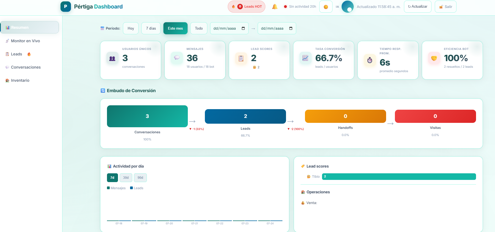

# 🏗️ Pértiga Dashboard — Real Estate AI Analytics

**Analytics dashboard for AI-powered WhatsApp real estate bot — Pértiga Soluciones**

A real-time analytics dashboard for monitoring WhatsApp conversations, lead scoring, property inventory, and AI bot performance. Built as part of the **Pértiga MVP** — an AI-powered real estate assistant that handles property search and scheduling via WhatsApp.


> 🇬🇧 **English summary below** — [Jump to English](#-english-summary) · [Full English README](README.en.md)

<!-- SCREENSHOTS -->


*Dashboard principal: KPIs en tiempo real (usuarios únicos, mensajes, leads, conversión), actividad por día (7d/30d/90d) y funnel de conversión.*


*Monitor en vivo: polling cada 5s de conversaciones activas, filtro por score de lead, estado del webhook Meta.*



*Sección Leads: scoring automático (nuevo/frío/tibio/caliente), filtros por operación/barrio/score, exportación CSV.*

## 🎯 Contexto

**Pértiga Soluciones SAS** es una empresa de automatización con IA. Uno de sus productos es un **bot de WhatsApp inmobiliario** ("Inmobiliaria Puerta") que atiene clientes automáticamente: busca propiedades, agenda visitas y qualifica leads.

Este dashboard es la **herramienta interna** que permite al equipo monitorear y gestionar el bot en producción. No es un producto para clientes — es la herramienta operativa del equipo.

## ✅ Qué hace

### 📊 Panel de Resumen
- **KPIs en tiempo real**: usuarios únicos, mensajes totales, leads, tasa de conversión
- **Gráficos de actividad**: mensajes y leads por día (7d / 30d / 90d)
- **Funnel de conversión**: Conversaciones → Leads → Handoffs → Visitas agendadas
- **Tiempo promedio de respuesta** del bot

### 📡 Monitor en Vivo
- **Streaming de conversaciones** en tiempo real (WebSocket-style polling)
- Auto-refresh configurable (on/off)
- Filtrado por estado del lead (hot/warm/cold)
- Indicador de estado del webhook de WhatsApp (Meta Cloud API)

### 📋 Leads
- **Lead scoring automático**: `nuevo` → `frío` → `tibio` → `caliente`
- Polling de hot leads con notificación visual (🔥)
- Prefencias guardadas: barrio, operación, tipo de propiedad, presupuesto
- Historial de conversación por lead
- Edición manual de scores y notas

### 💬 Conversaciones
- Histórico completo de mensajes por teléfono
- Búsqueda por número de teléfono
- Métricas por teléfono: cantidad de mensajes, propiedades mencionadas, última interacción
- Top 5 propiedades más mencionadas

### 🏠 Inventario de Propiedades
- CRUD completo: crear, editar, eliminar propiedades
- **289 propiedades** con embeddings vectoriales generados
- Filtros por ciudad, zona, tipo, estado
- Paginación y exportación CSV
- Importación masiva via JSON
- **Generación de embeddings** individuales y batch (via Ollama)
- Actualización de estado (disponible / reservado / vendido)

---

## 🏗️ Arquitectura

```
┌──────────────────────────────────────────────────────────────────┐
│                        DASHBOARD (Port 3002)                    │
│  ┌─────────────────────────────────────────────────────────────┐ │
│  │  index.html — Single Page App (Vanilla JS, 2800+ lines)    │ │
│  │  • Dashboard con KPIs, charts, funnel                      │ │
│  │  • Monitor en vivo (polling 5s)                            │ │
│  │  • CRUD de propiedades + embedding management              │ │
│  │  • Filtros por fecha, tablas con sort/pagination           │ │
│  └──────────────────────────┬──────────────────────────────────┘ │
│  ┌─────────────────────────────────────────────────────────────┐ │
│  │  server.js — Node.js HTTP server (530 lines)                │ │
│  │  • Session auth (sha256 + cookie)                           │ │
│  │  • Rate limiting (5 intentos / 15 min lockout)             │ │
│  │  • Proxy a PostgREST (injects API key server-side)          │ │
│  │  • Embedding generation via Ollama (bge-m3)                │ │
│  │  • Batch embedding para propiedades sin vector            │ │
│  └──────────┬───────────────────────────────┬──────────────────┘ │
└─────────────┼───────────────────────────────┼────────────────────┘
              │                               │
              ▼                               ▼
┌──────────────────────────┐    ┌─────────────────────────────────┐
│  PostgREST (Port 3000)   │    │  Ollama (Port 11434)            │
│  • REST API sobre        │    │  • Model: bge-m3 (embeddings)   │
│    PostgreSQL            │    │  • Generates 1024-dim vectors   │
│  • Tables: properties,  │    │  • Used for semantic search      │
│    leads, bot_convo,     │    │    on property inventory          │
│    appointments          │    └─────────────────────────────────┘
└───────────┬──────────────┘
            │
            ▼
┌──────────────────────────────────────────────────────────┐
│  Supabase / PostgreSQL                                   │
│  Tables:                                                 │
│  • properties (28 cols, incl. embedding vector(1024))    │
│  • leads (lead_score, budget, preferences)              │
│  • bot_conversations (role, content,timestamps)         │
│  • appointments (scheduled visits)                      │
│  • buscar_propiedades_hibrido (RPC function)            │
│    → hybrid search: semantic embedding + SQL filters    │
└──────────────────────────────────────────────────────────┘
```

### Flujo de datos del bot WhatsApp (contexto)

El dashboard consume datos generados por el **bot de WhatsApp** que funciona en paralelo:

```
Cliente WhatsApp
   │
   ▼
Meta Cloud API → Cloudflare Tunnel → Proxy Node.js (8090)
   │
   ▼
n8n Workflow (9QZcTKil0MZNgBhQ)
   ├── Stage 1: Extracción de filtros (LLM via Ollama)
   ├── Stage 2: Búsqueda semántica (PostgREST RPC + bge-m3 embeddings)
   ├── Respuesta conversacional (LLM via Ollama)
   ├── Persistencia (bot_conversations en PostgreSQL)
   └── Agendamiento (Google Calendar API)
   │
   ▼
PostgreSQL (leads, conversations, appointments)
   │
   ▼
Dashboard (este proyecto) ← consumo y gestión operativa
```

## 🔧 Stack Técnico

| Componente | Tecnología | Función |
|-----------|------------|---------|
| **Frontend** | Vanilla HTML/CSS/JavaScript (sin framework) | SPA con tabs, charts, tablas, modals |
| **Backend** | Node.js HTTP server (sin framework) | Auth, proxy API, embedding management |
| **Base de datos** | PostgreSQL (via Supabase) | properties, leads, conversations, appointments |
| **REST API** | PostgREST | Auto-generated REST CRUD sobre PostgreSQL |
| **Vector embeddings** | bge-m3 (via Ollama) | 1024-dim embeddings para búsqueda semántica |
| **Autenticación** | sha256 + cookie de sesión | Login con rate limiting y lockout |
| **Bot LLM** | Ollama + cloud models | Extracción de filtros y respuesta conversacional |

## 🛠️ Competencias técnicas demostradas

### Frontend (Vanilla JS, sin framework)
- **Arquitectura SPA** con sistema de tabs/secciones dinámicas
- **Gráficos custom** (barras, funnel) construidos a mano con CSS/flexbox
- **Sistema de polling** con auto-refresh configurable
- **Filtros avanzados**: rango de fechas (7d/30d/90d/custom), búsqueda, sort
- **Paginación** de tablas implementada manualmente
- **Exportación CSV** de inventario
- **Light/Dark theme** con persistencia en localStorage
- **Responsive design** (sidebar + bottom-nav en móvil)

### Backend
- **Servidor HTTP custom** (módulo `http` de Node, sin Express)
- **Sistema de autenticación** con SHA-256, sesiones con cookie, expiración 24h
- **Rate limiting**: 5 intentos → bloqueo 15 min (map en memoria)
- **Proxy reverse**: inyecta API key del lado del servidor (nunca expone al cliente)
- **Integración con Ollama** para generación de embeddings (batch + individual)
- **PostgREST proxy** con reintentos y timeout handling
- **Batch processing** de embeddings (50 propiedades concurrently)

### Base de datos y busca semántica
- **Esquema relacional** para CRM inmobiliario (properties, leads, conversations, appointments)
- **Búsqueda híbrida** (RPC en PostgreSQL): combine embeddings semánticos + filtros SQL duros
- **289 embeddings** generados con bge-m3 (1024 dimensiones)
- **Lead scoring** persistente con 4 niveles (nuevo/frío/tibio/caliente)
- **Vector similarity search** con pgvector

### Integraciones con APIs externas
- **Meta Cloud API** (WhatsApp Business) — recepción de webhooks
- **Ollama API** — generación de embeddings y LLM
- **PostgREST** — CRUD sobre PostgreSQL
- **Google Calendar API** — agendamiento de visitas (vía bot, visible en dashboard)

### DevOps e infraestructura
- **Nginx reverse proxy** con SSL/TLS (Let's Encrypt)
- **Systemd services** para procesos persistente
- **Docker Compose** para el stack (Supabase, n8n)
- **Cloudflare Tunnel** para webhooks de Meta
- **Logging** y monitoreo de estado del webhook

## 📊 Esquema de base de datos (simplificado)

```sql
-- Propiedades con embeddings vectoriales para búsqueda semántica
properties (
  id UUID PRIMARY KEY,
  title TEXT, property_type TEXT, operation_type TEXT,
  neighborhood TEXT, city TEXT, price BIGINT,
  rooms INT, bathrooms INT, area_sqm INT,
  tiene_piscina BOOL, tiene_gimnasio BOOL, ...  -- 20+ amenidades
  embedding VECTOR(1024),  -- bge-m3
  status TEXT DEFAULT 'disponible'
)

-- Leads con scoring automático
leads (
  id UUID PRIMARY KEY,
  phone_number TEXT UNIQUE,
  name TEXT, email TEXT,
  lead_score TEXT CHECK IN ('nuevo','frío','tibio','caliente'),
  budget_min BIGINT, budget_max BIGINT,
  preferred_neighborhood TEXT, preferred_property_type TEXT,
  preferred_operation TEXT CHECK IN ('venta','arriendo'),
  notes TEXT, last_contact_at TIMESTAMPTZ
)

-- Conversaciones del bot de WhatsApp
bot_conversations (
  id UUID PRIMARY KEY,
  phone TEXT, role TEXT CHECK IN ('user','assistant'),
  content TEXT, created_at TIMESTAMPTZ
)

-- Función RPC: búsqueda semántica híbrida
-- Combina embeddings + filtros SQL:
--   - Filtra duro por tipo, zifica, ciudad, operación
--   - Ordena por similitud coseno del embedding
--   - Boost por amenidades (no filtro duro)
buscar_propiedades_hibrido(
  query_embedding VECTOR(1024),
  match_threshold FLOAT, match_count INT,
  filtro_zona TEXT, filtro_operacion TEXT,
  filtro_tipo TEXT, filtro_ciudad TEXT,
  precio_maximo BIGINT, filtro_rooms_min INT,
  filtro_barrio TEXT, ...  -- 12 filtros de amenidades
)

-- Visitas agendadas (por el bot de WhatsApp)
appointments (
  id UUID PRIMARY KEY,
  lead_id UUID REFERENCES leads(id),
  property_id UUID REFERENCES properties(id),
  scheduled_at TIMESTAMPTZ,
  status TEXT CHECK IN ('agendada','confirmada','cancelada','completada')
)
```

## 📁 Estructura del repositorio

```
pertiga-dashboard/
├── README.md
├── README.en.md
├── LICENSE
├── src/
│   ├── server.js              # Backend Node.js (esqueleto)
│   └── index.html             # Frontend SPA (esqueleto)
└── docs/
    ├── arquitectura.md        # Detalles técnicos
    └── schema.sql             # Esquema de BD simplificado
```

> ⚠️ **Nota sobre el código fuente**: Por ser un producto comercial activo, el código fuente completo no está publicado. Los archivos en `src/` son esqueletos representativos que muestran la arquitectura y patrones utilizados, pero no incluyen la implementación completa.

## ⚠️ Notas

- Este dashboard es **parte del producto Pértiga** y se encuentra en **producción activa**
- El bot de WhatsApp asociado usa Meta Cloud API (cuenta de WhatsApp Business)
- Los datos de propiedades corresponden a **Inmobiliaria Puerta**, cliente de Pértiga
- El código fuente completo NO está publicado por ser producto comercial

## 🔗 Links relacionados

- **Sitio público**: https://pertigasoluciones.com
- **Otro proyecto público**: [Manualito en Daruma](https://github.com/pertiga-gio/manualito-en-daruma) — búsqueda de manuales de funciones

## 👤 Autor

Desarrollado por **Giovanni Sánchez Soto** — Junio-Julio 2026

Pértiga Soluciones SAS — Automatización con IA.
