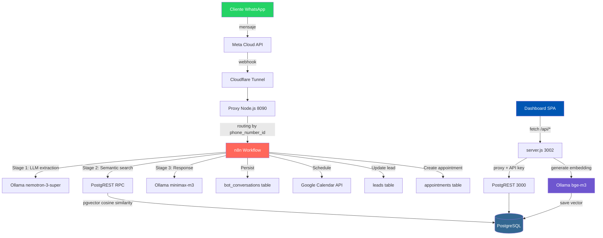
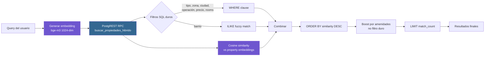
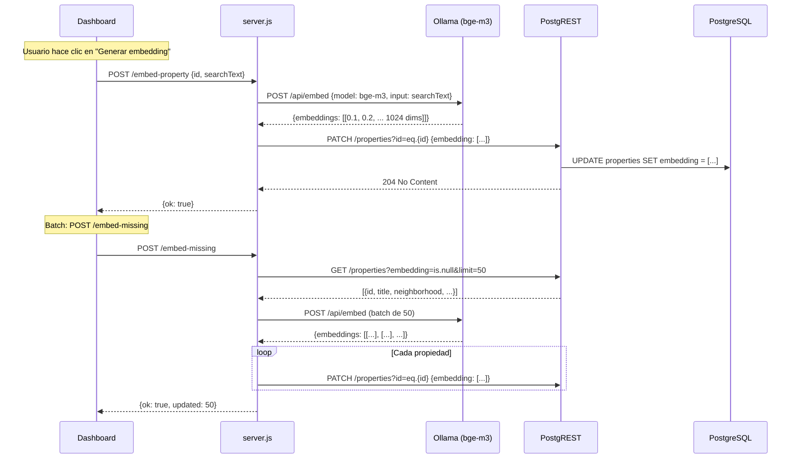

# Arquitectura Técnica — Pértiga Dashboard

## Visión general

Dashboard analítico para monitorear un bot de WhatsApp inmobiliario en producción. Construido con **Node.js puro** (sin framework) y **vanilla JavaScript** (sin React/Vue/Angular). Usa PostgreSQL (via Supabase) con pgvector para búsqueda semántica.

## Flujo de datos completo

## Componentes

### 1. Dashboard Frontend (`index.html`)
- **Tipo**: SPA (Single Page Application) vanilla JS
- **Tamaño**: ~2800 líneas (HTML + CSS + JS embebido)
- **Sin framework**: no React, no Vue, no Angular
- **Secciones**: Resumen, Monitor en Vivo, Leads, Conversaciones, Inventario
- **Temas**: Light/Dark con persistencia en localStorage
- **Responsive**: sidebar (desktop) + bottom-nav (móvil)

### 2. Dashboard Backend (`server.js`)
- **Tipo**: Servidor HTTP custom con el módulo `http` de Node.js
- **Sin Express, sin Fastify**: implementación directa
- **Endpoints**:
  - `POST /login` → autenticación SHA-256 + cookie
  - `GET /logout` → cerrar sesión
  - `GET /` → servir `index.html` con API key inyectada
  - `POST /embed-property` → generar embedding via Ollama
  - `POST /embed-missing` → batch embedding (50 concurrente)
  - `ALL /api/*` → proxy a PostgREST con API key

### 3. Búsqueda Semántica Híbrida

#### ¿Por qué híbrida?

| Búsqueda pura (vector) | Filtros puros (SQL) | Híbrida ✓ |
|----------------------|--------------------|-----------|
| Encuentra conceptos similares | Filtra exactos | Combina ambos |
| No respeta filtros duros | No entiende semántica | Respeta filtros + ordena por similitud |
| "apto cerca al parque" → matchea | "3 hab, Cali, < $300M" → exacto | "3 hab, Cali, < $300M, apto cerca al parque" |

### 4. Generación de Embeddings

## Optimizaciones de performance

### Frontend
- **Polling rate**: Monitor en vivo cada 5s (configurable)
- **Date filtering**: Filtrado en cliente (no re-fetch del server)
- **Chart rendering**: CSS puro, sin librerías de gráficos
- **Table pagination**: Implementación custom sin dependencias

### Backend
- **Batch embedding**: 50 propiedades concurrente via `UrlFetchApp.fetchAll`
- **Proxy con timeout**: 30s timeout en llamadas a Ollama/PostgREST
- **Rate limiting**: Map en memoria, limpieza periódica
- **Session cleanup**: Map en memoria con expiración 24h

### Base de datos
- **IVFFlat index** para búsqueda vectorial (lists=100)
- **B-tree indexes** en city, zona, operation_type, status
- **Índice compuesto** en bot_conversations(phone, created_at DESC)
- **RPC function** en SQL (no JS) para máxima performance
